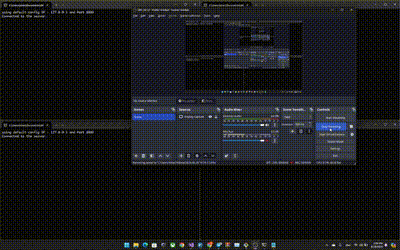

# TCP Server with Multi-Client Support using Asio

This repository contains a C++ implementation of a TCP server with multi-client support, built using Asio. The server is designed with an object-oriented approach, allowing it to handle multiple client connections concurrently.

## Table of Contents
- [Features](#features)
- [Prerequisites](#prerequisites)
- [Installation](#installation)
- [Run Program](#installation)

## Features
- **Object-Oriented Design:** Modular code structure for better maintainability and scalability.
- **Multi-Client Support:** Asynchronous I/O operations enable handling multiple clients concurrently.
- **Asio Integration:** Utilizes Asio for robust networking and asynchronous communication.


### Prerequisites
- **C++ Compiler:** A modern C++ compiler (C++11 or later).
- **Boost Library:** Ensure that Asio is installed on your system.

### Installation
1. Clone the repository:
   ```bash
   git clone https://github.com/SinaRezaeiTavirani/NetworkPractic.git
2. Build the projects in visual studio (in the near future I will make a cmake so it would be much easier).
3. To see colored output in Windows run EnableAnsiEscapeCodeSupport.reg

### Run Program
1. First run serverexample.exe and then clientexample.exe
2. Give Port number for Server and for client, give IP and port number like this
   ```bash
   serverexample.exe 9000
   clientexample.exe 127.0.0.1 9000
3. If you don't specify IP and Ports, it will run the defualts which is 127.0.0.1 with port 8080
4. You can test server and client connection with '1' key and '2'

## Demo


